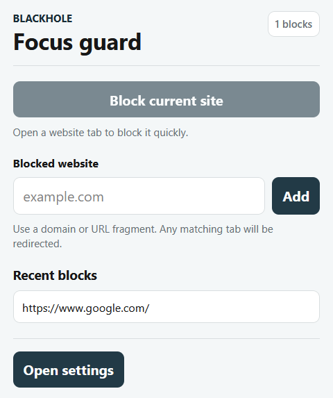
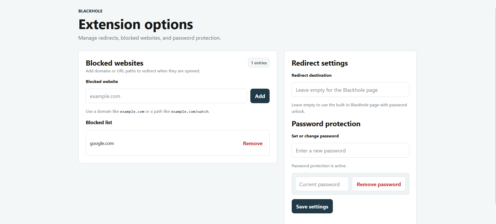
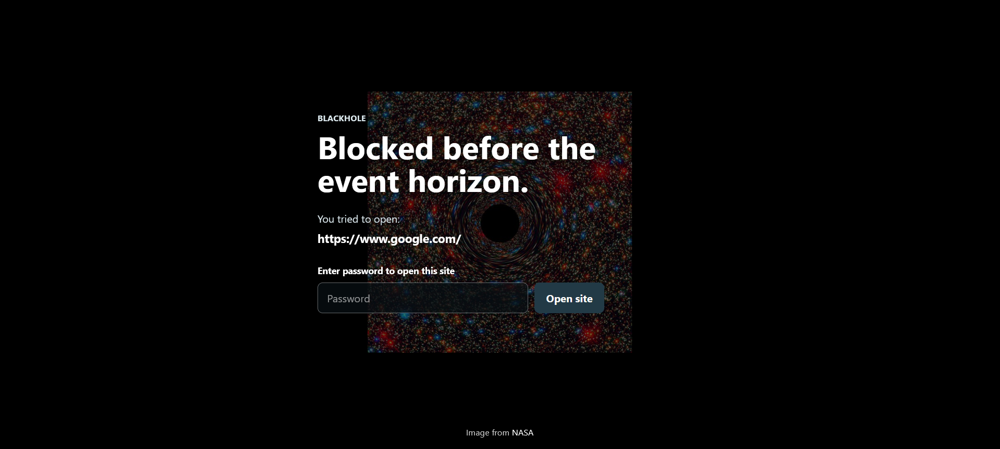

# Blackhole

Blackhole is a Chrome and Firefox extension that redirects selected websites to a focus screen.

## Preview

### Popup

The popup is intentionally small and focused on quick actions: block the current tab, add a typed domain, and review the last three unique blocked visits. Its top badge counts total blocked visits, including repeated attempts, while full blocklist entries live in the extension options page.



### Options Page

The options page is the full management surface for blocked entries, redirect settings, and password protection.



### Blocked Page

The built-in Blackhole page shows the blocked URL and lets you open it temporarily after password confirmation.



## Features

- Add blocked domains or URL paths from the popup or options page.
- Use domain-aware matching, so `google.com` blocks `www.google.com` and `mail.google.com`, but not `notgoogle.com`.
- Redirect blocked tabs to the built-in Blackhole page by default.
- Show the blocked URL on the Blackhole page.
- Temporarily open a blocked URL after password confirmation.
- Configure a custom redirect destination from the options page.
- Protect blocked-site removal with a password.
- Manage full settings in a dedicated browser options page.
- Run locally in Chrome and Firefox.

## How Matching Works

Blackhole stores its configuration in the browser's local extension storage. When a tab URL changes, the background script parses the URL and checks it against the blocked list.

Examples:

```text
Blocked entry: google.com
Blocks:        https://google.com
Blocks:        https://www.google.com
Blocks:        https://mail.google.com
Does not block: https://notgoogle.com
```

Path-specific entries work too:

```text
Blocked entry: example.com/watch
Blocks:        https://example.com/watch/video
Does not block: https://example.com/profile
```

If the redirect destination is empty, Blackhole uses the built-in `redirect.html` page. If a custom redirect destination is configured, blocked tabs go there instead.

## Usage

### Popup

1. Open the Blackhole popup from the browser toolbar.
2. Click **Block current site** or enter a domain/path in **Blocked website**.
3. Click **Add** when using the text field.
4. Review the recent blocked visits shown in the popup.
5. Use **Open settings** for full list management, redirect settings, and password configuration.

### Options Page

Open the options page from the popup or from the browser's extension management screen.

Use it to:

- Add or remove blocked websites.
- Set a custom redirect destination.
- Set or change the removal password.
- Remove the password by entering the current password.

### Blackhole Page Unlock

When a blocked website redirects to the built-in Blackhole page:

1. The blocked URL is shown on screen.
2. Enter the configured password.
3. Click **Open site**.

The URL opens temporarily, but the blocked entry remains in your list for future visits.

## Local Installation

Clone or download this repository, then load it as a temporary or unpacked extension.

### Chrome

1. Open Chrome.
2. Go to `chrome://extensions`.
3. Enable **Developer mode**.
4. Click **Load unpacked**.
5. Select the project folder that contains `manifest.json`.
6. Open the Blackhole popup from the toolbar.
7. Add a blocked website, such as `example.com`.
8. Open `https://example.com` and confirm that it redirects.

After changing extension files, go back to `chrome://extensions` and click **Reload** on the Blackhole extension card.

### Firefox

1. Open Firefox.
2. Go to `about:debugging`.
3. Click **This Firefox**.
4. Click **Load Temporary Add-on...**.
5. Select this project's `manifest.json` file.
6. Open the Blackhole popup from the toolbar.
7. Add a blocked website, such as `example.com`.
8. Open `https://example.com` and confirm that it redirects.

After changing extension files, go back to `about:debugging` and click **Reload** on the Blackhole extension entry.

## Project Files

```text
manifest.json   Extension metadata, permissions, popup, options page, and background setup
background.js   Storage, messaging, URL matching, redirect logic, and temporary unlock flow
popup.html      Quick-action popup markup
popup.js        Quick-action popup behavior
style.css       Quick-action popup styling
options.html    Extension options page markup
options.js      Extension options page behavior
options.css     Extension options page styling
redirect.html   Built-in Blackhole page markup
redirect.js     Built-in Blackhole page unlock behavior
redirect.css    Built-in Blackhole page styling
```

## Development Notes

- The extension uses Manifest V3.
- Chrome uses `background.service_worker`.
- Firefox uses `background.scripts`.
- `options_ui` points to `options.html` and opens it in a tab.
- Browser state is stored in `chrome.storage.local`.

## Roadmap

- [x] Add Firefox support.
- [x] Add GUI configuration settings for blocked URLs.
- [x] Add GUI configuration settings for redirect destination URL.
- [x] Add password confirmation for blocked URL removal.
- [x] Add a dedicated options page.
- [x] Add Blackhole page password unlock.
- [x] Add manual installation guide.
- [ ] Implement reverse mode to allow access to only selected hostnames and block access to others.
- [ ] Implement custom redirection for a single blocked hostname.
- [ ] Implement time-based blocking.
- [ ] Publish to the Chrome Web Store.
- [ ] Publish to Firefox Add-ons.

## References

- [Chrome Extensions documentation](https://developer.chrome.com/docs/extensions/get-started)
- [Firefox Extension Workshop](https://extensionworkshop.com/documentation/develop/temporary-installation-in-firefox/)
