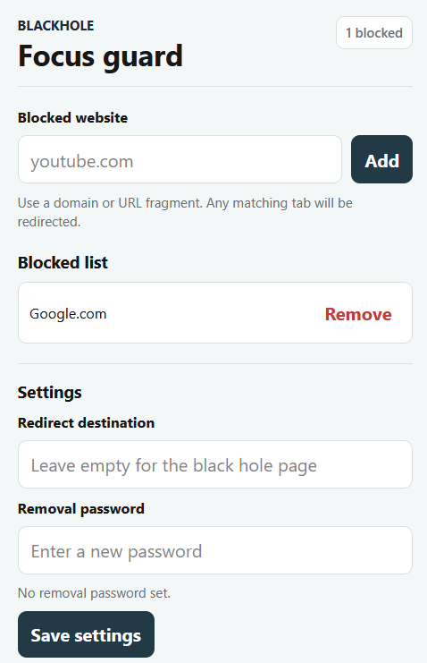

# Blackhole

Blackhole is a lightweight Chrome and Firefox extension for redirecting distracting or forbidden websites to a focus page.



## Features

- Add URL fragments or domains to a blocked list.
- Redirect matching tabs to the built-in Blackhole page.
- Show the blocked URL on the Blackhole page.
- Open a blocked site temporarily after password confirmation.
- Configure a custom redirect destination.
- Set a removal password before blocked URLs can be removed.
- Works locally in Chrome and Firefox.

## How It Works

Blackhole stores your configuration in the browser's local extension storage. When a tab URL changes, the background script checks the blocked list. If the current URL contains one of your saved fragments, the tab is redirected to the configured destination.

Examples of blocked entries:

```text
youtube.com
twitter.com
example.com/path
```

If the redirect destination is empty, Blackhole uses the built-in `redirect.html` page.

## Local Installation

Clone or download this repository, then load it as a temporary or unpacked extension in your browser.

### Chrome

1. Open Chrome.
2. Go to `chrome://extensions`.
3. Enable **Developer mode**.
4. Click **Load unpacked**.
5. Select the project folder that contains `manifest.json`.
6. Pin or open the Blackhole extension from the toolbar.
7. Add a blocked website, such as `example.com`.
8. Open `https://example.com` in a tab and confirm that it redirects.

After changing extension files, go back to `chrome://extensions` and click **Reload** on the Blackhole extension card.

### Firefox

1. Open Firefox.
2. Go to `about:debugging`.
3. Click **This Firefox**.
4. Click **Load Temporary Add-on...**.
5. Select this project's `manifest.json` file.
6. Open the Blackhole extension from the toolbar.
7. Add a blocked website, such as `example.com`.
8. Open `https://example.com` in a tab and confirm that it redirects.

After changing extension files, go back to `about:debugging` and click **Reload** on the Blackhole extension entry.

## Usage

1. Open the extension popup.
2. Enter a domain or URL fragment in **Blocked website**.
3. Click **Add**.
4. Optional: set a **Redirect destination**.
5. Optional: set a **Removal password**.
6. Visit a matching website to confirm the redirect.

To remove a blocked website:

- If no removal password is set, click **Remove**.
- If a removal password is active, click **Remove**, enter the password, then confirm.

To remove the password itself, use the **Current password** field in the settings section and click **Remove password**.

## Project Files

```text
manifest.json   Extension metadata, permissions, popup, and background setup
background.js   Storage, messaging, and redirect logic
popup.html      Extension popup markup
popup.js        Popup behavior and settings UI
style.css       Popup styling
redirect.html   Built-in redirect page
redirect.js     Built-in redirect page behavior and unlock flow
redirect.css    Built-in redirect page styling
```

## Development Notes

- The extension uses Manifest V3.
- Chrome uses `background.service_worker`.
- Firefox uses `background.scripts`.
- Both entries are kept in `manifest.json` for cross-browser local testing.

## Roadmap

- [x] Add Firefox support.
- [x] Add GUI configuration settings to modify blocked URLs.
- [x] Add GUI configuration settings to modify redirect destination URL.
- [x] Add GUI configuration to set a password for URL removal.
- [x] Redesign configuration settings.
- [ ] Implement reverse mode to allow access to only selected hostnames and block access to others.
- [ ] Implement custom redirection for a single blocked hostname.
- [ ] Implement time based blocking to access hostnames at specified times.
- [x] Add manual instruction guide to readme.
- [ ] Publish to the Chrome Web Store.
- [ ] Publish to the Firefox Add-ons.

## References

- [Chrome Extensions documentation](https://developer.chrome.com/docs/extensions/get-started)
- [Firefox Extension Workshop](https://extensionworkshop.com/documentation/develop/temporary-installation-in-firefox/)
